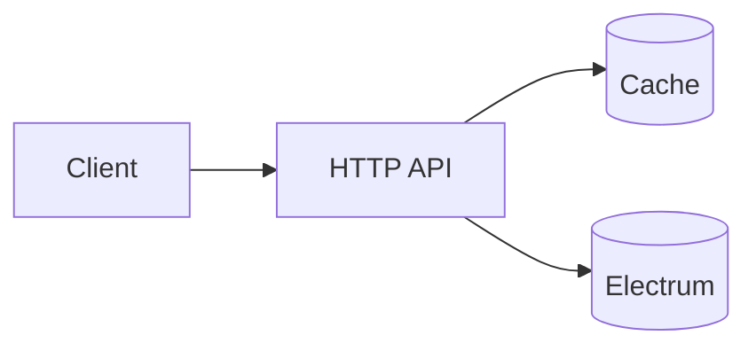

# Developer Handbook (Read Once, Refer Often)

Purpose: Explain the roadmap legend, Developer Toolkit, core delivery terms, and our diagram authoring/export workflow. Use this when a term looks unfamiliar. Keep PRs concise and reference this guide instead of over‑explaining in code.

## How to use this handbook (reading order)

If you’re new, skim in this order and jump via the links:
- Start here: Glossary (plain-language terms) → [Glossary](#glossary-a–z)
- See the “what” and “why”: System Diagrams → [System Diagrams: Authoring and Exports](#system-diagrams-authoring-and-exports)
- Backend plan (Express + ws): [Backend Initialization Plan](#backend-initialization-plan-express--ws)
- i18n foundations (multi-language/RTL): [Internationalization (i18n)](#internationalization-i18n-architecture--workflow)
- Monorepo usage (root vs workspaces): [Monorepo and Root Package Management](#monorepo-and-root-package-management)
- After we install packages: [Setup after package install](#setup-after-package-install-cleanup-and-stricter-checks)
- How we work: [Delivery Methodologies](#delivery-methodologies-how-to-work-effectively)
- Daily tool: [Developer Toolkit](#developer-toolkit-explained) and [Execution Checklists] in project docs
- Full docs index: `docs/README.md`
- Before PR: [Code Review Checklist](#code-review-checklist) and [PR/Commit Conventions](#prcommit-conventions)

## Glossary (A–Z)

- ADR (Architecture Decision Record): One page describing an important design decision and why we chose it over alternatives.
- Artifacts: The tangible outputs you must produce (code, tests, OpenAPI/JSON Schemas, dashboards, runbooks, ADRs).
- Canary: Gradual rollout (e.g., 5%→25%→50%→100%) with monitoring gates at each step to catch issues safely.
- DoD (Definition of Done): The objective set of checks that must be true before merging/deploying.
- DoR (Definition of Ready): The objective set of preconditions that must be true before starting work.
- Kill switch: A feature flag or config toggle that instantly disables a feature without redeploying.
- OpenAPI/Contract: Machine-readable API description used to validate requests/responses and enable contract tests.
- Rollback plan: Concrete steps (commands/flags) to revert safely if things go wrong.
- SBOM (Software Bill of Materials): A machine-readable inventory of all dependencies (including versions and transitive deps) used by the project. It enables security scans, license checks, and supply-chain risk tracking. We will generate SBOMs during CI and update them when dependencies change. Common formats/tools: CycloneDX, SPDX.
- Secrets: Sensitive values such as API keys, database passwords, JWT secrets, and RPC credentials. Secrets must never be committed to the repo. Store them in environment variables or a secret manager (later phases). Document placeholders in `.env.example` and reference them in docs.
- Templates (secrets/config): The documented placeholders and example files used to provision environments, e.g., `.env.example` or secret manager templates. Developers copy and fill them locally; CI/staging/production fetch real secrets from secure stores.
- SLI/SLO: Indicator/Objective. Example: SLO “P95 latency < 200ms”; SLI is the measured P95.
- SLO budget (Error budget): Acceptable allowance for missing the SLO over a time window.
- SBOM generation: The process of producing SBOM artifacts during CI (e.g., CycloneDX JSON) to track supply-chain risk. We will document exact commands in CI once packages exist.
- Secrets rotation: Operational practice of changing secrets on a schedule or after incidents. Document rotation windows and owners.
- Feature flag: Runtime-configurable toggle to enable/disable behavior without redeploying. Used for canary and safe rollback.

## Legend (what each gate means)

- $ Version Control Checkpoint: Branches, conventional commits, submodules pinned to known-good.
- # Testing Validation: Unit/integration/E2E plan and coverage thresholds enforced in CI.
- @ Bitcoin-Specific Validation: Cross-checks vs Bitcoin Core; script/consensus-aware tests.
- * Performance & Security Review: Budgets declared; basic threat model; scans clean.
- & Documentation & Knowledge Transfer: README updates, runbooks, ADR when architecture changes.
- % Deployment Checkpoint: Canary plan, health checks, rollback rehearsal in staging.
- 🚀 DevOps Automation: Pipelines and IaC updated so work is repeatable and fast.
- 🔒 Security & Compliance: SBOM, licenses, secrets policy, dependency health.
- 📊 Monitoring & Observability: Metrics, alerts, tracing that are actionable (no noise).
- 🔄 Continuous Improvement: Retro items folded back into work; toil and regressions driven down.

## Developer Toolkit (explained)

Task Template fields
- Goal: One sentence outcome (what users/systems gain).
- Scope guard: What is explicitly out of scope to prevent creep.
- Budgets: Latency/memory/SLOs your change must respect.
- Risks: Consensus correctness, performance, or security concerns to watch.

DoR checks
- Issue + branch: Traceability and isolation.
- Test plan: Which tiers (unit/integration/E2E) and fixtures you’ll add.
- Consensus review: If parsing scripts or touching Bitcoin semantics, list your Core RPC parity plan.
- Perf/Sec budgets: Declare expectations and threat surfaces.
- Docs list: Exact files/sections to update (README is command/source-of-truth).
- Rollback: Feature flag name and how to disable; include canary percentages.
- CI/IaC: Which workflows and infra code need updates.
- Secrets/SBOM: New env vars or deps? Capture in SBOM and templates.
- SLOs/signals: Which dashboards and alerts you’ll watch during rollout.

Decision responsibilities (who does what)
- Developer: proposes changes, updates docs/templates, opens PR with impacts listed
- Reviewer: validates security/perf/consensus impacts; checks SBOM deltas and license posture
- Security lead (as needed): reviews secrets handling and rotation, sensitive dependency risks

Artifacts
- Contracts: OpenAPI or JSON Schemas to lock interfaces, enabling contract tests.
- Code + tests: Keep diffs small; critical paths TDD where feasible.
- Dashboards/alerts: New metrics with thresholds; avoid noisy alerts.
- Runbooks/ADR: How to operate and why we chose this path.

DoD checks
- CI green; coverage thresholds met.
- SLOs within budgets; alerts quiet after rollout.
- Docs updated and cross-linked.
- Flags enabled and rollback rehearsed in staging.
- For Bitcoin-affecting work: Core RPC parity sample set matched.

## Environments

### Development Environment (Current State - Validated)
- **Windows Host**: Backend/frontend run in Docker containers, electrs runs natively
- **Linux VM (Ubuntu LTS)**: Bitcoin Core runs with shared folder access to external drive
- **Network Topology**: 
  - VM IP: `192.168.1.67` (accessible from Windows host `192.168.1.3`)
  - Bitcoin Core RPC: `192.168.1.67:8332` (bound to both localhost and VM IP)
  - Bitcoin Core P2P: `192.168.1.67:8333`
  - ZMQ: `127.0.0.1:28332` (local only)
- **Storage**: External drive `B:\bitcoin-data` shared via VirtualBox to `/media/sf_bitcoin-data`
- **Connectivity**: 
  - Windows → VM: ✅ `Test-NetConnection "192.168.1.67:8332"` passes
  - electrs → Bitcoin Core: ✅ Direct TCP connection to VM IP
  - Docker → electrs: ✅ `host.docker.internal:50001` accessible
- **Status**: Bitcoin Core synced to block 910,659 (100% complete), electrs running and indexing

### Production Environment (Planned)
- **AWS**: Private subnets for Core/electrs; public for API/CDN
- **Multi-AZ**: electrs (active/standby) with health-checked failover
- **API**: Behind gateway/ingress with security groups
- **Object Storage**: S3 for media and analytics data

## When to flag/canary

- Trigger canary for: Any user-visible change, consensus-affecting logic, new API/contract, performance-sensitive path, or infra change.
- Default canary: 5%→25%→50%→100%, pausing at each step until SLOs stable.

## Quick Links

- README: Commands, environment, submodule, and runbooks.
- Roadmap: Phases and modules; Developer Toolkit (concise instructions).
- Execution Checklists: Per-phase gate-by-gate tasks.
- Additional Data Collection: Analytics ETL and views.
- Future Considerations: Inscriptions/media, Lightning, forks.
- Automation Playbook: CI/CD and collaboration automation (see `docs/automation-playbook.md`).
- Onboarding Guide: Step-by-step developer onboarding (see `docs/onboarding.md`).
 - Electrs WSL2 Stability: see `docs/infrastructure/electrs-wsl2-stability.md`.

---

## System Diagrams: Authoring and Exports

Diagrams live in `project-documents/system-diagrams/` as Markdown with Mermaid code blocks. We treat diagrams as code: they are versioned, reviewed, and exported to static images for quick sharing.

### Authoring
- Write diagrams inside fenced blocks marked as `mermaid` in `.md` files.
- Keep one logical diagram per file; group related notes below the block.
- Prefer semantic names: `09-component-electrum-adapter.md`, `10-use-case-diagram.md`, `11-package-diagram.md`.
- Before big changes, add or update a diagram stub first. Design in diagrams, then implement.

Example block:



### Viewing Options
- VS Code: Install “Markdown Preview Mermaid Support” and open preview.
- Web: Paste a block into the Mermaid Live Editor (`https://mermaid.live`).
- Static docs: Use MkDocs (`mkdocs-mermaid2-plugin`) or Docusaurus with Mermaid enabled.

### Exporting PNG/SVG (Windows/PowerShell)
We provide a script that scans Markdown files under `project-documents/system-diagrams/` and exports every Mermaid block to PNG and SVG.

- Script: `project-documents/system-diagrams/exports/export-diagrams.ps1`
- Output: `project-documents/system-diagrams/exports/*.png` and `*.svg`

Prerequisite (planned; do not run yet until `package.json` exists):

```bash
npm install -D @mermaid-js/mermaid-cli
```

Run (from repo root):

```powershell
pwsh project-documents/system-diagrams/exports/export-diagrams.ps1
```

Parameters:
- `-InputDir`: Directory to scan for `.md` files. Defaults to parent of `exports` (the `system-diagrams` folder).
- `-OutDir`: Output directory. Defaults to the `exports` folder.
- `-Theme`: Mermaid theme (`default`, `dark`, `forest`, `neutral`). Default: `default`.

Examples:
```powershell
# Use dark theme and export to exports/dark
pwsh project-documents/system-diagrams/exports/export-diagrams.ps1 -Theme dark -OutDir ./dark

# Scan the entire project-documents subtree
pwsh project-documents/system-diagrams/exports/export-diagrams.ps1 -InputDir ../../
```

What the script does:
- Recursively finds `*.md` files (excluding `exports/`).
- Extracts each `mermaid` fenced block with a robust regex.
- Renders PNG and SVG for each block via `mmdc` (Mermaid CLI).
- Names outputs as `<markdown-file-name>-<block-index>.png|svg`.

Troubleshooting:
- “Could not find 'mmdc'”: install locally (after `package.json` is created) or add a global `mmdc` to PATH.
- Ensure Mermaid blocks are fenced exactly with ` ```mermaid ` (open) and ` ``` ` (close) on separate lines.
- Large diagrams may need layout tweaks; consult Mermaid docs for `%%{init: { 'theme': 'dark' }}%%` and graph config.

Conventions and Quality
- Keep diagrams minimal yet complete; prefer clarity over density.
- Document non‑obvious choices beneath the diagram.
- Keep exports updated in PRs that change diagrams.
 - Cross-check diagrams with `00-model-spec.md` during review; update both when architecture evolves.

---

## Backend Initialization Plan (Express + ws)

### Goals
- Robust HTTP API using Express with clear layering and contracts.
- Realtime updates via `ws` (WebSocket) for mempool/chain events.
- Electrum TCP integration with reliability and caching.
- Strong defaults for security, logging, observability, and testing.

### Naming Conventions (CRITICAL)
**Backend MUST follow our centralized naming conventions:**
- **Reference**: `frontend/src/constants/naming-conventions.md` - Single source of truth
- **Action Types**: Use clean, concise names (e.g., `BLOCK_NEW`, not `RECEIVE_NEW_BLOCK_FROM_BACKEND`)
- **API Endpoints**: Follow RESTful patterns (e.g., `/api/v1/blocks`, not `/api/bitcoin/blocks/retrieve`)
- **WebSocket Events**: Use dot notation (e.g., `block.new`, not `bitcoin-block-new-received`)
- **Data Types**: Follow `[Entity][Type]` pattern (e.g., `BitcoinBlock`, not `BitcoinBlockDataInterface`)

**Implementation**: Backend will implement the opposite side of frontend actions, maintaining consistency across the entire system.

### Proposed Directory Structure (documented first)
We will create this tree during implementation; shown here for orientation:

```
backend/
  src/
    app.ts                # Express app wiring (routes, middlewares)
    server.ts             # HTTP server bootstrap, graceful shutdown
    config/
      env.ts              # Env parsing (dotenv + safe validation)
      logger.ts           # pino logger setup
    middlewares/
      error-handler.ts    # Centralized error mapping
      cors.ts             # CORS config
      security.ts         # helmet, rate limit
    routes/
      index.ts            # Router registration
      health.routes.ts
      electrum.routes.ts  # HTTP endpoints
    controllers/
      electrum.controller.ts
    services/
      electrum.service.ts # Business logic orchestrating adapters + cache
    adapters/
      electrum/
        electrum.client.ts  # Electrum TCP client wrapper
        circuit-breaker.ts  # Opossum or custom breaker
      cache/
        redis.cache.ts
    ws/
      hub.ts              # ws server + topics
      events.ts           # event contracts & broadcasting helpers
    contracts/
      http.schemas.ts     # zod/joi schemas for HTTP requests/responses
      ws.schemas.ts       # ws message schemas
    utils/
      result.ts           # typed success/failure helpers
      time.ts
    tests/
      integration/
      unit/
```

### Planned Dependencies (Backend)
- Runtime
  - express: HTTP framework
  - ws: WebSocket server
  - electrum-client (or custom TCP client if needed)
  - ioredis: Redis client (L1 cache)
  - pino: structured logging
  - helmet: secure headers
  - cors: CORS control
  - express-rate-limit: basic rate limiting
  - dotenv: env file loading
  - zod (preferred) or joi: request/response validation
  - env-var (optional): typed env parsing
- Reliability
  - opossum (optional): circuit breaker; otherwise minimal custom breaker
  - p-retry / p-timeout (optional): retries with jitter, timeouts
- Dev / Build / Quality
  - typescript, ts-node, tsconfig-paths
  - eslint, @typescript-eslint/eslint-plugin, @typescript-eslint/parser, eslint-config-prettier
  - prettier
  - jest, ts-jest, @types/jest, supertest,@types/supertest
  - nodemon (local dev)
- Docs / Utilities
  - @mermaid-js/mermaid-cli (dev) for diagram exports

Note: Package installation happens only after we finalize this plan.

### Electrum Integration Options
- Option A: Library-based (`electrum-client`)
  - Pros: Faster to integrate, battle-tested, community support
  - Cons: Less control over low-level TCP behavior and edge-case tuning
- Option B: Custom TCP wrapper
  - Pros: Full control over protocol handling, timeouts, pooling, backpressure
  - Cons: Higher complexity and maintenance cost; more testing required

Current decision: Start with Option A (`electrum-client`) for MVP and reliability. Revisit custom TCP wrapper in a later hardening phase if needed (performance, control, or edge-case handling).

Implications:
- Contracts and services should keep the Electrum client behind an adapter interface to allow swapping implementations without touching controllers/routes.
- Circuit breaker, retries, and timeouts remain the same regardless of implementation choice.

### Configuration (Environment)
- Required
  - ELECTRUM_HOST: Electrum server hostname
  - ELECTRUM_PORT: 50001 (TCP) or 50002 (TLS)
  - ELECTRUM_TLS: true|false
  - REDIS_URL: e.g., redis://localhost:6379
  - PORT: HTTP port (default 3000)
  - NODE_ENV: development|production|test
  - LOG_LEVEL: info|debug|warn|error
  - CORS_ORIGIN: allowed origins
- Optional
  - RATE_LIMIT_WINDOW_MS, RATE_LIMIT_MAX
  - WS_HEARTBEAT_MS
  - ELECTRUM_REQUEST_TIMEOUT_MS, ELECTRUM_MAX_RETRIES

### HTTP Endpoints (initial set)
- GET `/health` → liveness/readiness
- GET `/v1/address/:addr/txs` → address history
- GET `/v1/fee/estimates` → current estimates
- POST `/v1/tx/broadcast` → broadcast raw hex `{ hex: string }`

### WebSocket Topics (initial)
- `mempool:newTx` → broadcast on new tx subscription
- `address:txs:{addr}` → push updates for watched addresses

### Reliability & Caching
- Circuit breaker around Electrum RPCs (fail fast when backend unhealthy)
- Timeouts and retry with jitter for Electrum calls
- Redis L1 cache for stable reads (fee estimates, address history window)
- Idempotent broadcast handling

### Security & Hardening
- `helmet` for headers; `cors` restricted to known origins
- `express-rate-limit` on public endpoints
- Input validation via zod on all routes
- Structured logs (pino) without PII
- Do not log raw tx hex unless explicitly debug-flagged
 - Secrets: Never log or commit; read via env only. Document placeholders in `.env.example` and instructions in README. Plan rotation.

### Observability
- Request logs with latency and status codes
- Basic counters/timers (extend with OpenTelemetry later)
- Correlation IDs propagated to Electrum calls
 - Health endpoints: `/health` (liveness), `/ready` (readiness)

### Electrs stability hardening (WSL2 VM)
- Storage: keep electrs `db_dir` on ext4 (inside WSL filesystem or an ext4‑formatted mount via `wsl --mount`), not under `/mnt/<drive>`.
- Limits: raise open files before launch (`ulimit -n 8192`).
- Throttle: `db_parallelism=1`, `ignore_mempool=true` while syncing; consider `index_batch_size=500-1000` if supported; increase `jsonrpc_timeout` (e.g., `60s`).
- Resilience: `reindex_last_blocks=1000`, `auto_reindex=true`.
- Controlled pauses: wrap with `timeout --signal=INT <seconds>` to exit cleanly and resume later.
- Windows host: disable USB selective suspend; High performance power plan; AV exclusions on electrs DB path.

## Current Infrastructure State (Validated - 2025-08-18)

### Network Configuration
- **VM IP Address**: `192.168.1.67` (VirtualBox Ubuntu LTS VM)
- **Windows Host IP**: `192.168.1.3`
- **Network Segment**: `192.168.1.0/24` (home network)
- **Gateway**: `192.168.1.1`

### Bitcoin Core Status
- **Version**: Pre-release test build (main branch)
- **Sync Status**: Block 910,659 of 910,659 (100% complete)
- **Chain**: mainnet
- **Storage**: 774GB on external drive via VirtualBox shared folder
- **RPC Binding**: 
  - `127.0.0.1:8332` (localhost)
  - `192.168.1.67:8332` (VM IP - external access)
- **P2P Port**: `192.168.1.67:8333`
- **ZMQ Ports**: `127.0.0.1:28332` (raw block), `127.0.0.1:28333` (raw tx)

### Electrs Status
- **Version**: 0.10.10 (x86_64 Windows native)
- **Process**: Running (PID 21000, 163MB memory)
- **Database**: `B:\bitcoin-data\electrs-db\bitcoin`
- **Electrum RPC**: `0.0.0.0:50001` (external access enabled)
- **Monitoring**: `127.0.0.1:4224` (Prometheus metrics)
- **Bitcoin Core Connection**: `192.168.1.67:8332` (VM IP)
- **Cookie File**: `B:\bitcoin-data\.cookie`

### Connectivity Validation
- **Windows → Bitcoin Core VM**: ✅ `Test-NetConnection "192.168.1.67:8332"` passes
- **Electrs → Bitcoin Core**: ✅ Direct TCP connection established
- **Docker → Electrs**: ✅ `host.docker.internal:50001` accessible
- **External → Electrs**: ✅ Port 50001 listening on all interfaces

### Storage Configuration
- **External Drive**: `B:\bitcoin-data` (Windows)
- **VM Mount Point**: `/media/sf_bitcoin-data` (VirtualBox shared folder)
- **Shared Folder Name**: `bitcoin-data`
- **Permissions**: User `blocksight` (UID/GID 1002) in `vboxsf` group
- **Symlink**: `/home/blocksight/.bitcoin` → `/media/sf_bitcoin-data`

### Docker Environment
- **Status**: ✅ Build successful, compose working
- **Backend Port**: `localhost:8000`
- **Redis Port**: `localhost:6379`
- **Network**: Docker bridge with host access via `host.docker.internal`

### Testing Strategy
- Unit: services, adapters with fakes/mocks
- Integration: HTTP routes with supertest; ws events with ws client
- Contract: validate responses via zod schemas
- Optional: golden samples vs Bitcoin Core RPC for parity on selected flows
 - Tooling: Jest + ts-jest as the test runner; supertest for HTTP assertions. CI runs tests after lint/build.

### Server-side procedures: placement & conventions
- Where logic lives
  - Backend services: orchestrations across Electrum + cache (our primary "procedures").
  - PostgreSQL: analytics views/materialized views and fn_* functions for heavy, reusable computations close to data. Prefer views/MVs; use PL/pgSQL only for compute reuse.
  - Redis: Lua/Redis Functions for atomic cache operations (stampede protection, counters), time-bounded and side‑effect limited to cache.
  - electrs/RocksDB: never modified; no procedures here.
- Naming/versioning
  - SQL: schema `analytics`, prefix fn_* for functions and mv_* for materialized views; version via migrations.
  - Redis: function:<name>:v1 (or script:<name>:v1), SHA/version checked at app startup.
  - Backend services: suffix Procedure for multi‑call orchestrations (e.g., AddressSummaryProcedure), zod-typed IO.
- Testing
  - SQL: snapshot tests or pgTAP; explain plans reviewed; runtime metrics observed.
  - Redis: integration tests invoking functions; timeouts ≤ 50ms; fallback path covered.
  - Backend: unit tests with fakes; integration with supertest; contract validation via zod.

### Proposed npm Scripts (to be added after `package.json` is created)
```json
{
  "scripts": {
    "dev": "nodemon --exec ts-node --transpile-only backend/src/server.ts",
    "start": "node dist/backend/src/server.js",
    "build": "tsc -p tsconfig.json",
    "typecheck": "tsc -p tsconfig.json --noEmit",
    "lint": "eslint . --ext .ts",
    "format": "prettier --write .",
    "test": "jest --runInBand",
    "test:watch": "jest --watch",
    "docs:diagrams": "pwsh project-documents/system-diagrams/exports/export-diagrams.ps1"
  }
}
```

### Dev Services (Redis via Docker)
- For local development, we recommend running Redis via Docker:
  - Start: `docker run -d --name blocksight-redis -p 6379:6379 redis:7-alpine`
  - Stop/Remove: `docker rm -f blocksight-redis`
- These are also provided as root npm scripts (see root `package.json`).
- Every developer can choose whether to enable Redis locally; features will degrade gracefully if Redis is not running (cache misses fall back to Electrum).

---

## Monorepo and Root Package Management

Purpose of root `package.json`:
- Orchestrate multiple workspaces (`backend`, `frontend`) with a single set of commands
- Provide shared scripts (e.g., `dev`, `build`, `lint`, `typecheck`, `test`) that fan out to workspaces
- Manage developer services (e.g., Redis via Docker) and docs exports (`docs:diagrams`)

Why each workspace has its own `package.json`:
- Isolate dependencies and scripts per surface (backend vs frontend)
- Enable independent builds/tests while keeping a unified top-level workflow

How to use:
- Use root scripts for day-to-day multi-project development
- Use workspace scripts with `-w backend` or `-w frontend` when focusing on a single surface
 - After installs, CI will run `typecheck`, `lint`, `build`, and `test` for all workspaces; keep diffs small to speed feedback

Containers First
- Prefer `docker compose -f docker-compose.dev.yml up -d --build` for local stack and service DNS routing
- Use service names (e.g., `redis`, `backend`) when one container talks to another; use `host.docker.internal` to reach host-only services
- See `docs/infrastructure/docker.md` for commands and notes

### ESLint strict overrides (paste and adapt after installs)
```json
{
  "overrides": [
    {
      "files": ["backend/**/*.ts"],
      "parserOptions": { "project": ["./backend/tsconfig.json"], "tsconfigRootDir": "__dirname" },
      "env": { "node": true }
    },
    {
      "files": ["frontend/**/*.ts", "frontend/**/*.tsx"],
      "parserOptions": { "project": ["./frontend/tsconfig.json"], "tsconfigRootDir": "__dirname", "ecmaFeatures": { "jsx": true } },
      "env": { "browser": true }
    }
  ]
}
```

---

## Language Strategy: TypeScript vs JavaScript (3D Frontend Considerations)

Position:
- Backend: TypeScript is mandatory for safety, contracts, and maintainability
- Frontend: TypeScript by default; allow pragmatic interop for 3D libraries

3D stack options that work well with TypeScript:
- three.js with `@types/three`
- react-three-fiber (R3F) + drei helpers (TypeScript-friendly)

Interop guidance for 3D libraries with weak/missing types:
- Use ambient module declarations or `// @ts-expect-error` in narrow scopes
- Prefer JSDoc types for performance-critical loops if TS typing becomes a bottleneck
- Keep strict typing at the integration and component boundaries; relax only inside low-level rendering logic as needed

Performance notes:
- TypeScript compiles away and does not impact runtime performance
- For hot rendering paths, minimize allocations and object churn; rely on profiling, not typing, to optimize

Outcome:
- We keep TS across the repo to maximize correctness and maintainability, while allowing targeted flexibility in the 3D layer

---

## Internationalization (i18n) Architecture & Workflow

Standards
- Framework: i18next (frontend) with react-i18next
- Languages: `en`, `es`, `he` (RTL), `pt` in Phase 1; expand later via the same structure
- No hardcoded UI text: only translation keys in components
- Locale formatting: use `Intl` APIs for dates, numbers, and currency; bind fiat currency selector to locale-aware formatting
- RTL: auto-direction for RTL locales; mirror HUD/UI chrome; keep world/3D coordinates stable

Filesystem
```
frontend/
  src/
    i18n/
      index.ts                # i18n bootstrap
      locales/
        en/translation.json
        es/translation.json
        he/translation.json
        pt/translation.json
```

Guidelines
- Key naming: `feature.section.item` (e.g., `nav.home`, `fee.gauge.title`)
- Fallback: default `en`; log missing keys in development; CI check in hardening phase
- RTL audits: verify flex/grid directions, iconography mirroring where meaningful
- 3D overlays: use locale-aware fonts and text rendering; confine `@ts-expect-error` to local interop if types are weak

Contributor Flow
1. Add keys in `en/translation.json` and propagate placeholders to other locales
2. Reference keys via `t('...')` in components; avoid literals
3. Run missing-key check (added to CI in Phase 2) and fix
4. Visual QA for RTL vs LTR; verify layout mirroring and icon directionality

---

## Setup after package install (cleanup and stricter checks)

After we run npm install and add devDependencies:
- Remove temporary TypeScript shims at `backend/src/types/dev-shims.d.ts`
- Remove `// @ts-nocheck` from `backend/src/server.ts`
- Enable stricter ESLint parser options with project references:
  - Root `.eslintrc.json` backend override: set `parserOptions.project` to `./backend/tsconfig.json`
  - Root `.eslintrc.json` frontend override: set `parserOptions.project` to `./frontend/tsconfig.json`
- Add `@types/node`, `@types/express`, and other types as needed
- Run: `npm run typecheck`, `npm run lint`, `npm run build`

---

## Delivery Methodologies (how to work effectively)

Scrum (Sprints)
- Timeboxed iterations (1–2 weeks). Commit to a small, valuable increment.
- Rituals: planning, daily standup, review, retrospective.
- Good for predictable cadence and stakeholder visibility.

Kanban
- Continuous flow, WIP limits, pull-based work. Suits ops-heavy or interrupt-driven work.
- Visualize flow, reduce bottlenecks, optimize cycle time.

Extreme Programming (XP)
- Pair programming: driver (types), navigator (reviews in real time); switch roles frequently.
- TDD: write a failing test, implement, refactor.
- Continuous integration: integrate multiple times per day.
- Collective code ownership and simple design.

Pair Programming Patterns
- Strong-style pairing: “For an idea to go from your head to the computer, it must go through someone else’s hands.” Useful for onboarding juniors.
- Ping-pong TDD: dev A writes a failing test; dev B makes it pass; swap.

Practical guidance for juniors
- Start from the issue template and Developer Toolkit DoR.
- Sketch the change in diagrams or annotate the relevant parts.
- Implement the smallest slice; keep PR diffs small; push tests alongside code.
- Ask for early review if touching Bitcoin semantics, security, or performance-critical paths.
 - Use pair programming for unfamiliar areas; rotate roles and keep sessions timeboxed (45–60 min).

---

## Code Review Checklist
- Scope: One logical change; linked issue; diagrams/specs updated if architecture changed
- Tests: Unit/integration added or updated; coverage preserved; contract validations included
- Quality: Lint/typecheck clean; no unused code; error handling present; logs are useful and PII-free
- Security: No secrets in code; input validation; rate limits in place where needed
- Performance: Budgets considered; no obvious N+1s; caching used where appropriate
- i18n: No hardcoded text; keys added to all locales; RTL checked for UI components
- Docs: README or handbook updated when commands, env, or workflows change

---

## Micro-cycle: 45–60 minute coding session (pre → during → post)

Use this timebox to ship a small, high-quality increment. Adjust minutes as needed but keep the phases.

Time budget
- Pre (5–10 min): clarify, design, guardrails
- During (25–35 min): implement with tests
- Post (10–15 min): verify, document, align

Pre (5–10 min)
- Confirm the ticket scope and acceptance criteria; restate in one sentence
- Scan `00-model-spec.md` and relevant system diagrams; note any boundary changes you foresee
- Identify risks/budgets touched (perf, security, consensus, i18n/RTL)
- Decide approach (pattern, function signature, data flow); write a tiny design note if non-trivial
- For a bug fix: reproduce locally, capture the failing case; for a new function: write 1–2 high‑value tests you expect to pass
- List all companion updates you expect (schemas, i18n keys, docs, diagrams) so you don’t forget in post

During (25–35 min)
- Implement smallest viable slice; prefer TDD where feasible (red → green → refactor)
- Follow `code-standard.md`: strict typing, early returns, clear names, error handling pattern, logging without PII
- Adhere to contracts/schemas; update or add zod/OpenAPI schemas if interfaces change
- i18n: never hardcode UI strings; add translation keys and use `t('...')`; consider RTL impact
- Add/adjust unit tests and, when touching routes, integration tests; keep tests descriptive
- Keep diffs small and cohesive; avoid unrelated refactors

Post (10–15 min)
- Run: typecheck, lint, build, and tests; address any failures
- Re-check diagrams and `00-model-spec.md`. If boundaries changed, update the relevant diagram and add a note to the PR
- Update documentation (README sections, handbook notes) and example `.env` keys if needed
- Export diagrams if you changed them (see `docs:diagrams` script)
- Walk the Code Review Checklist; add a brief “What changed / Why / Risks / Rollback” note to your PR description
- If you deferred items, file follow-up tasks and reference them

Function creation pattern (micro)
- Define intent and signature (inputs, outputs, error shape) in one line
- Decide the error strategy (Result type vs throw) and performance budget(s)
- Write the first failing test; implement the happy path; add guard clauses; cover error path(s)
- Refactor for clarity; ensure naming communicates intent

Bug fix pattern (micro)
- Reproduce; write a failing test capturing the bug
- Implement the minimal fix; avoid collateral changes
- Add a regression test if different from the reproducer; document the root cause in the PR

Worked example (no code): Implement fee estimate fetcher
- Pre: confirm endpoint contract `GET /v1/fee/estimates` (zod schema); diagram shows adapter → electrum client; perf budget P95 < 200ms (cached)
- During: write test expecting normalized shape `{fast, normal, slow}`; implement `getFeeEstimates()` service calling adapter, add Redis L1 cache (TTL 1–2s); validate with zod; log with correlation id
- Post: run checks; add schema docs; update diagram note (cache path used); ensure i18n keys for any UI labels exist; write PR with risks (cache TTL choices) and rollback (disable cache via flag)

### Implementation Sequence (Backend)
1. Finalize dependency choices and scripts in this handbook
2. Create `package.json` and `tsconfig.json`; add ESLint/Prettier configs
3. Scaffold `backend/src` structure and minimal Express app + health route
4. Add ws hub and a basic heartbeat
5. Implement Electrum client wrapper, timeouts, breaker
6. Implement routes + validation + logging + error handler
7. Wire Redis cache paths where applicable
8. Write unit/integration tests and wire npm scripts
9. Add CI later (lint, typecheck, build, test)

### Notes for Contributors
- Follow `code-standard.md` for error handling, loading states, and cleanup rules
- Keep controller thin; move logic to services; adapters remain IO-only
- Use schemas to validate both input and output; contract-first when feasible

## Backend HTTP API – Bootstrap Snapshot

The frontend gates its splash screen using a minimal snapshot from the backend.

- Method: `GET /api/v1/bootstrap`
- Purpose: Provide the fastest-available network readiness signal for the UI.
- Response:
```
{
  "height": number,               // Electrum tip height
  "coreHeight": number | null,    // Bitcoin Core height when enabled
  "mempoolPending": number | null, // Core pending tx count; null when unavailable
  "mempoolVsize": number | undefined, // Electrum histogram derived vsize (approximate)
  "asOfMs": number,
  "source": "electrum"
}
```

Caching & Metrics:
- L1 key: `l1:bootstrap:v1`, TTL ≈ 3 seconds
- Metrics recorded: `bootstrap` latency and cache hit/miss

Notes:
- If Core is disabled, `coreHeight` is omitted and `mempoolPending` may be null.
- This endpoint is not for live updates; the WebSocket remains the primary realtime channel.

### Electrum vs Core Controller Separation

- Electrum Controller (`backend/src/controllers/electrum.controller.ts`)
  - Electrum-backed endpoints only (fees, electrum height, electrum mempool fallback).
  - L1 cache keys: `l1:fees:estimates:v1`, `l1:network:height:v1`, `l1:mempool:summary:v1`.

- Core Controller (`backend/src/controllers/core.controller.ts`)
  - Core-backed endpoints only: `/core/height`, `/core/mempool`.
  - L1 cache keys: `l1:core:height:v1`, `l1:core:mempool:summary:v1`.

- Bootstrap Controller (`backend/src/controllers/bootstrap.controller.ts`)
  - Orchestrates both sources for cold-start: `/bootstrap` with TTL ≈ 3s (`l1:bootstrap:v1`).
  - Returns `height`, optional `coreHeight`, and mempool fields for quick readiness.