# BlockSight.live - State Diagram: Circuit Breaker & Connection Lifecycle

## Overview

Closed/Open/Half‑Open behavior for Electrum endpoint calls with retries, jittered backoff, and quarantine/health‑probe logic.

```mermaid
stateDiagram-v2
  [*] --> Closed

  Closed: Normal traffic; count failures; reset on success
  Closed --> Open: failureCount >= threshold
  Closed --> Closed: success

  Open: Drop calls; serve from cache; schedule probe
  Open --> HalfOpen: timeout expires

  HalfOpen: Allow limited probe(s)
  HalfOpen --> Closed: probe success
  HalfOpen --> Open: probe failure

  state Open {
    [*] --> Waiting
    Waiting: Exponential backoff with jitter
    Waiting --> Waiting: sleep(backoff)
  }

  state Connections {
    [*] --> Healthy
    Healthy --> Unhealthy: ping timeout | error rate spike
    Unhealthy --> Quarantined: consecutive failures
    Quarantined: Remove from rotation; health probe async
    Quarantined --> Healthy: probe OK (latency < SLA, errors ~ 0)
  }

  note right of Closed
    Metrics:
    - electrum_call_latency_ms{method}
    - electrum_errors_total{type}
    - tip_lag_blocks
    Actions:
    - admit traffic within budgets
  end note

  note right of Open
    Degrade:
    - serve from L1/L2/HTTP cache
    - reduce WS cadence/payload
    - alert on SLO breach
  end note
```

Notes
- Thresholds/timeouts come from config; budgets enforced by backpressure controller.
- Quarantine removes sick endpoints; background probes restore only when healthy.
- Pair with admission control (shed non‑critical load first).
