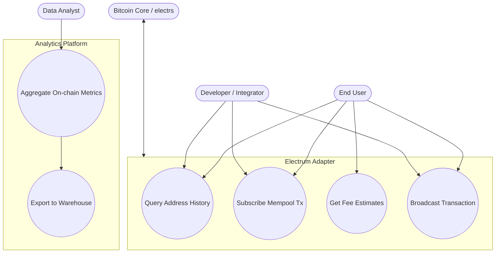

# BlockSight.live - Use Case Diagram (High Level)

## Scope
End users and system actors interacting with the adapter and analytics surfaces.

Notes
- End User and Developer consume REST/WS surfaces; Node provides ground truth (Bitcoin Core/electrs).
- Analytics aggregates derived metrics and exports to long‑term storage.
