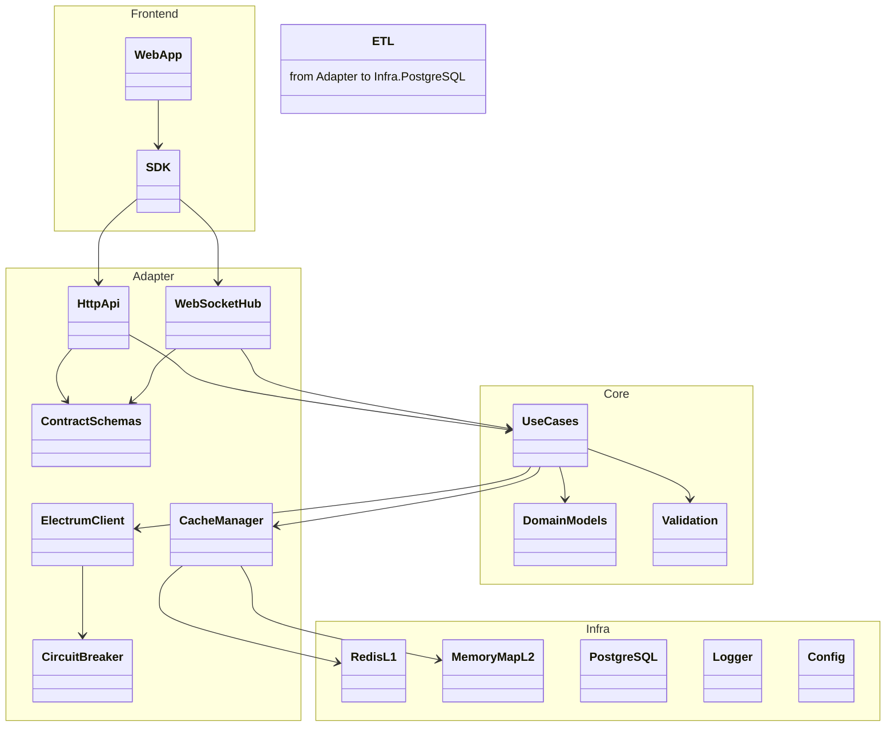

# BlockSight.live - Package Diagram

## Overview
Logical packaging of components and their dependencies.

Notes
- `Adapter` exposes interfaces, `Core` hosts business logic, `Infra` provides persistence and operational concerns, `Frontend` consumes exposed contracts.
- Electrum access is guarded by circuit breaker; caching uses multi‑tier approach.
- Current choice: use `electrum-client` behind an adapter interface; later we may swap to a custom TCP wrapper without changing higher layers.
